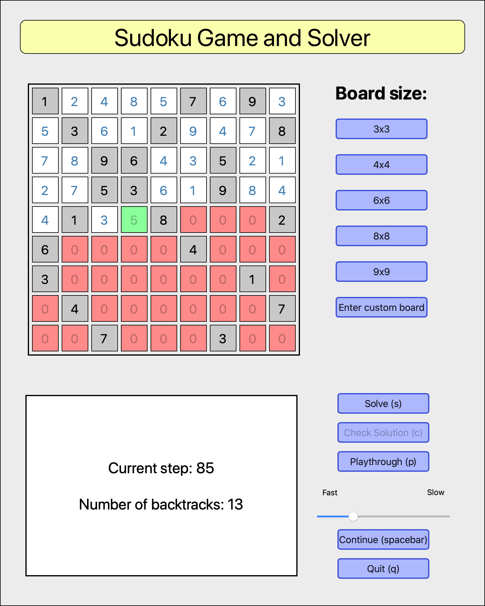

# backtrack-sudoku

Sudoku solver using the backtrack algorithm



## The project

An app that allows the user to try their hand at solving a range of sudoku puzzles of various sizes and difficulties.

It incorporates a built-in solver that rapidly solves puzzles of any size using the recursive backtrack algorithm.

The user can try to solve the puzzle and check their solution, or simply ask the app to solve the puzzle itself. They can also watch a playthrough of the backtrack algorithm in action, at different speeds, serving as a learning tool.

## Important scripts

`solve_sudoku.py` contains all the functions necessary to solve a given board.

`solve_sudoku_recursive.py` is a newer and faster backtrack algorithm that uses recursion.

`sudoku_gui.py` contains all the code for the GUI.

`main.py` is the controller that connects the model (solver) and the view (GUI).

There are programs to test the algorithm on 3x3, 4x4, 6x6, 8x8 and 9x9 boards, which are the same boards built in to the app.

## Dependencies
```
Python3
PyQt5
```

## Potential future improvements

Add a stepper so the user can take a closer look at the solving algorithm by stepping forward through each iteration or running it back in time.

Add some heuristics to speed up/vary the solving algorithm, so it's not purely backtracking.

Add an ability for the user to save a custom board locally so it becomes on of the app's built-in boards.
